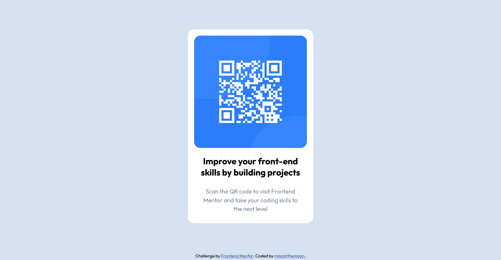

# Frontend Mentor - QR code component solution

This is a solution to the [QR code component challenge on Frontend Mentor](https://www.frontendmentor.io/challenges/qr-code-component-iux_sIO_H). Frontend Mentor challenges help you improve your coding skills by building realistic projects. 

## Table of contents

- [Overview](#overview)
  - [Screenshot](#screenshot)
  - [Links](#links)
- [My process](#my-process)
  - [Built with](#built-with)
  - [What I learned](#what-i-learned)
  - [Continued development](#continued-development)
  - [Useful resources](#useful-resources)
- [Author](#author)
- [Acknowledgments](#acknowledgments)

## Overview

### Screenshot

### Links

- Solution URL: [github](https://github.com/MazontheMoon/frontendmentor-qr-code-component)
- Live Site URL: [githhub pages](https://mazonthemoon.github.io/frontendmentor-qr-code-component/)

## My process

### Built with

- Semantic HTML5 markup
- Flexbox
- Mobile-first workflow

### What I learned

I enjoyed learning to follow a design that was given to me rather than designing and redesigning myself as I went along!

I reinforced the lesson that I cannot vertically center a div without setting a specific height on the parent!!

### Continued development

I'm looking forward to expanding my skills to effectively convert a given design into a responsive accessible document.

### Useful resources

- [MDN webdocs](https://developer.mozilla.org/en-US/) - This helped me quickly find the properties I wanted to use with my CSS flex elements

## Author

- LinkedIn - [Mary Ronan](https://www.linkedin.com/in/mary-ronan/)
- Frontend Mentor - [@MazontheMoon](https://www.frontendmentor.io/profile/MazontheMoon)
- Twitter - [@maz_ronan](https://twitter.com/maz_ronan)
- Codepen - [MazOnTheMoon](https://codepen.io/mazonthemoon)

**Note: Delete this note and add/remove/edit lines above based on what links you'd like to share.**

## Acknowledgments

Thank you [FrontendMentor](https://www.frontendmentor.io/learning-paths/getting-started-on-frontend-mentor-XJhRWRREZd/steps/6617f0172f40450f9122e6ca/challenge/start) for the challenge.
